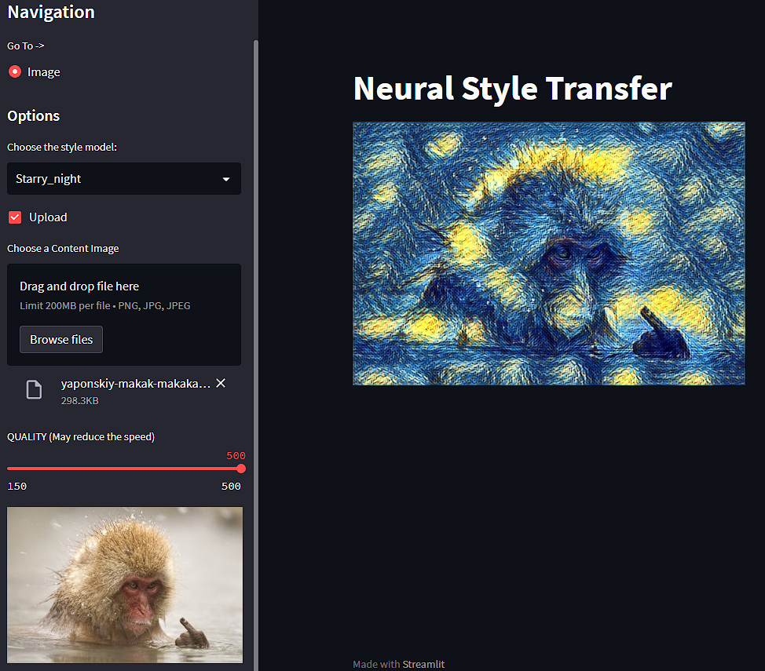

# Style-transfer-web-app

[Веб-приложение для тестирования в браузере](https://style-transfer-web-app-khavi.streamlit.app/):

Есть возможность выставить удовлетворяющее качество инференса по шкале с ползунком.

## Ссылки на источники

* [Обучение моделей](https://github.com/khav-i/nn_works/blob/master/Style%20transfer/README.md)

* [Еще один пример обучения модели переноса стиля](https://github.com/malraharsh/Neural-Style-Transfer/tree/main)

* [pyFlaskOpenCV](https://github.com/Reine0017/pyFlaskOpenCV/blob/master/README)

* [Модели и статьи Fast Neural Style](https://github.com/jcjohnson/fast-neural-style)
